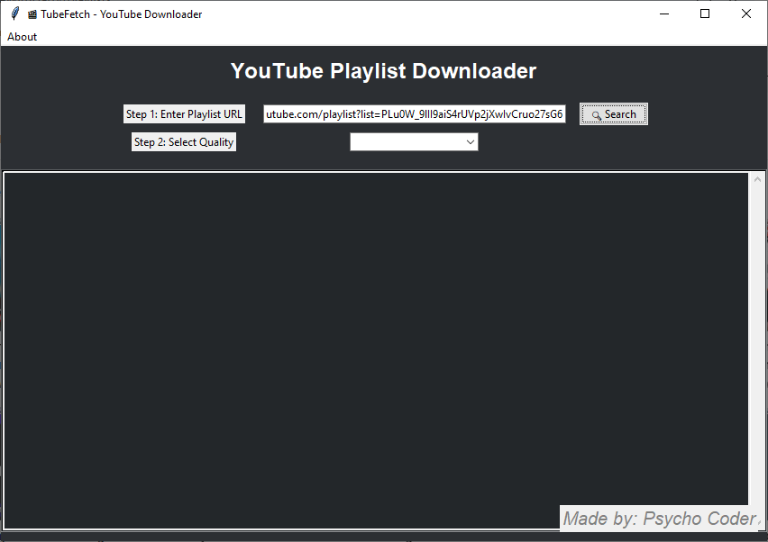
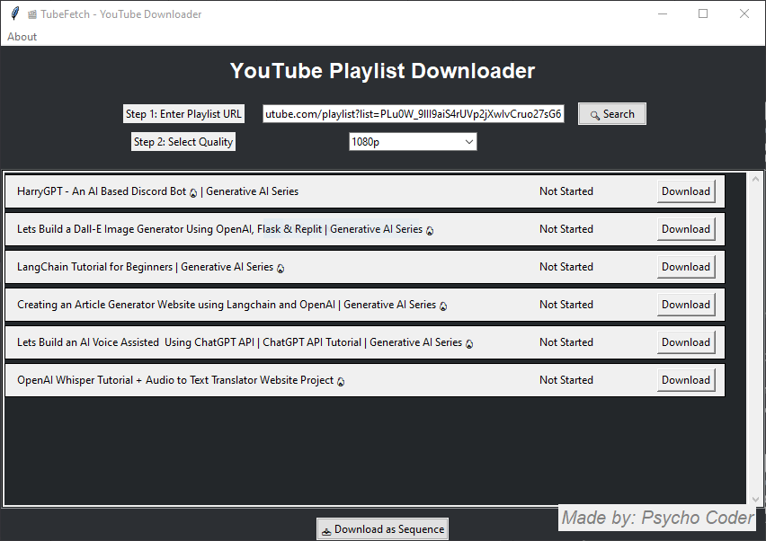

# TubeFetch - YouTube Video Downloader | Python Automation  

This project automates the process of downloading YouTube videos and playlists with a **one-click** solution. Built using `yt-dlp`, it allows users to download videos in different resolutions while preserving audio.

---

## 🚀 Features  

✅ Download **single videos** or **entire playlists**  
✅ Choose video quality (e.g., **1080p, 720p, 480p**)  
✅ Preserves **video + audio** in MP4 format  
✅ **Progress tracking** for each video  
✅ **Batch downloading** with automatic sequencing  

---

## 🛠️ Installation  

### 1️⃣ Install `ffmpeg` (Required)  
Before running the script, you **must have `ffmpeg` installed** on your system.  

#### 🔹 Windows:  
1. **Download `ffmpeg` from this link:**  
   [ffmpeg-master-latest-win64-gpl.zip](https://github.com/BtbN/FFmpeg-Builds/releases/download/latest/ffmpeg-master-latest-win64-gpl.zip)  
2. Extract the folder and place it somewhere (e.g., `C:\ffmpeg\`).  
3. **Set the environment variable:**  
   - Search for **"Edit the system environment variables"** in Windows.  
   - Click **Environment Variables > System Variables > Path > Edit**.  
   - Click **New** and add the path to the `bin` folder inside `ffmpeg`, e.g., `C:\ffmpeg\bin`.  
   - Click **OK** and restart your terminal.  

#### 🔹 Linux/macOS:  
```bash
sudo apt install ffmpeg  # Debian-based Linux
brew install ffmpeg       # macOS (Homebrew)
```

To verify installation, run:

```bash
ffmpeg -version
```

## Clone this repository
```bash
git clone https://github.com/itspsychocoder/TubeFetch
```
```bash
cd TubeFetch
```
### 3️⃣ Install dependencies
```bash
pip install -r requirements.txt
```

# 🎯 How to Use

### 1️⃣ Run the GUI file
```bash
python gui.py
```
The following UI will open


### 2️⃣ Enter YouTube playlist URL
Enter playlist url and click on search button.
The program will automatically fetch details and display available video qualities.

**When you click on search button, the process may take some time depending upon your number of videos in a playlist. So you may have to give some time so script can get info of all videos. For instance, normal playlist with apprxox 30-40 videos, it will take 2-3 mints to process all videos.**




### 3️⃣ Choose the resolution
After sometime, you will get all videos of playlist in area. Select the desired quality you want to download video in from dropdown.




### 4️⃣ Start downloading
Click on Download button next to video to download that video.

OR you can click or "Download as Sequence" button to download whole playlist as once. This will Download each video one by one.
